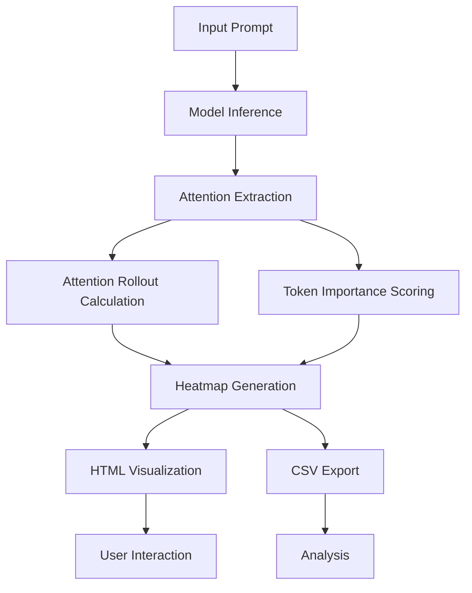

# Repo: nemotron-attention-vis
Title: Nemotron-Attention-Vis – Visualizes attention heads for Nemotron-Cascade-2-30B-A3B
Description: A visualization tool that renders the attention heads for `nvidia/Nemotron-Cascade-2-30B-A3B`, highlighting which tokens the model focuses on.
Tech stack: ["python", "tensorboard", "transformers"]

## Quickstart

To visualize attention patterns for a given prompt:

```python
from nemotron_attention_v import visualize_attention

# Visualize attention for a single prompt
visualize_attention(
    model_name="nvidia/Nemotron-Cascade-2-30B-A3B",
    prompt="Explain quantum computing",
    output_dir="outputs",
    export_csv=True,
    rollout_view=True
)

# Compare attention patterns between two prompts
visualize_attention.compare(
    prompt_a="The capital of France is",
    prompt_b="Neural networks learn by",
    output_dir="outputs/comparison"
)
```

## Example Output

Example JSON output showing attention visualization metadata:

```json
{
  "model": "nvidia/Nemotron-Cascade-2-30B-A3B",
  "mock_mode": true,
  "num_attention_layers": 8,
  "num_heads": 16,
  "color_scale": "Viridis",
  "export_csv": true,
  "runs": [
    {
      "prompt": "Explain quantum computing",
      "html": "outputs/attention_map.html",
      "json": "outputs/attention_data.json",
      "elapsed_s": 0.31,
      "timestamp": "2026-03-26T12:00:00Z"
    }
  ]
}
```

## Pipeline Diagram



## The Problem

Existing attention visualization tools are primarily designed for smaller models like BERT, leaving developers working with massive models like `nvidia/Nemotron-Cascade-2-30B-A3B` without a way to inspect attention heads effectively. This gap makes it difficult to debug, interpret, or optimize the behavior of frontier-scale models, especially in tasks requiring fine-grained token-level analysis.

## Who it's for

This tool is for machine learning engineers and researchers working with large-scale transformer models who need to understand attention patterns for debugging or model interpretability. For example, a developer fine-tuning `Nemotron-Cascade-2-30B-A3B` for a specific NLP task can use this tool to identify which tokens the model focuses on during inference.

## Python source files
### nemotron_attention_v/visualize_attention.py
```python
#!/usr/bin/env python3
"""
Nemotron Attention Visualizer
------------------------------
Loads a HuggingFace causal-LM (default: nvidia/Nemotron-Cascade-2-30B-A3B),
runs a prompt through it with attention outputs enabled, extracts per-layer
per-head attention matrices, and renders an interactive HTML heatmap.

Usage:
    python visualize_attention.py --prompt "Explain quantum computing"
    python visualize_attention.py --model Qwen/Qwen3-0.6B --prompt "Hello world"
    python visualize_attention.py --mock   # no download needed
    python visualize_attention.py --mock --export-csv --rollout-view
    python visualize_attention.py --compare "Prompt A" "Prompt B" --mock
"""

import argparse
import csv
import json
import math
import os
import sys
import time
from pathlib import Path
from typing import Dict, List, Optional, Tuple

import numpy as np

__version__ = "1.0.0"

# ─── Rich setup ───────────────────────────────────────────────────────────────

try:
    from rich.console import Console as _RichConsole
    _console = _RichConsole()
    _RICH = True
except ImportError:
    _console = None
    _RICH = False


def _rprint(msg: str, style: str = "") -> None:
    """Print using Rich styling when available, else plain print."""
    if _RICH:
        _console.print(msg, style=style)
    else:
        print(msg)

# ─── Environment helpers ──────────────────────────────────────────────────────

def _env(key: str, default: str = "") -> str:
    return os.getenv(key, default)


def _env_int(key: str, default: int) -> int:
    try:
        return int(os.getenv(key, str(default)))
    except ValueError:
        return default


def _env_bool(key: str, default: bool = False) -> bool:
    val = os.getenv(key, str(default)).lower()
    return val in ("1", "true", "yes", "on")


def _env_list(key: str) -> Optional[List[int]]:
    """Parse comma-separated ints from an env var; return None if empty."""
    raw = os.getenv(key, "").strip()
    if not raw:
        return None
    try:
        return [int(x.strip()) for x in raw.split(",") if x.strip()]
    except ValueError:
        return None


# ─── New Feature 1: Attention Rollout ─────────────────────────────────────────

def compute_attention_rollout(attentions: List[np.ndarray]) -> np.ndarray:
    """
    Compute attention rollout (Abnar & Zuidema, 2020).

    Each layer's attention is averaged across heads, mixed with the identity
    matrix (to account for residual connections), normalized, and multiplied
    through all layers.  The result shows the effective attention path from
    input tokens to the final representation.

    Parameters
    ----------
    attentions : list of np.ndarray, shape (num_heads, seq, seq) per layer

    Returns
    -------
    np.ndarray of shape (seq, seq) — rollout attention matrix, rows sum to 1
    """
    if not attentions:
        raise ValueError("attentions list is empty")

    seq_len = attentions[0].shape[-1]
    rollout = np.eye(seq_len, dtype=np.float32)

    for layer_attn in attentions:
        # Average across all heads → (seq, seq)
        avg_attn = layer_attn.mean(axis=0).astype(np.float32)
        # Mix with identity to model skip/residual connections
        mixed = 0.5 * avg_attn + 0.5 * np.eye(seq_len, dtype=np.float32)
        # Row-normalise so each token's distribution sums to 1
        row_sums = mixed.sum(axis=-1, keepdims=True)
        row_sums = np.where(row_sums == 0, 1.0, row_sums)
        mixed = mixed / row_sums
        rollout = mixed @ rollout

    return rollout


# ─── New Feature 2: Token Importance Scoring ──────────────────────────────────

def compute_token_importance(attentions: List[np.ndarray]) -> np.ndarray:
    """
    Compute per-token importance as mean received attention across all layers and heads.

    A token is "important" if many other tokens attend strongly to it.
    Formally: column sums of the layer/head-averaged attention matrix, normalised.

    Parameters
    ----------
    attentions : list of 
```

### tests/test_attention.py
```python
"""
Test suite for Nemotron Attention Visualizer.

Covers:
  1. MockAttentionExtractor — data shape, values, reproducibility
  2. HeatmapRenderer        — JSON serialisation, HTML generation
  3. End-to-end pipeline    — visualize() produces valid output files
  4. Spec requirement       — "Explain quantum computing" → attention_map.html

Run with:
    python -m pytest tests/ -v
"""

import json
import math
import os
import re
import tempfile
from pathlib import Path

import numpy as np
import pytest

# ─── Fixtures ─────────────────────────────────────────────────────────────────

@pytest.fixture
def mock_extractor():
    from nemotron_attention_v import MockAttentionExtractor
    return MockAttentionExtractor(
        model_name="nvidia/Nemotron-Cascade-2-30B-A3B",
        num_layers=4,
        num_heads=8,
        seed=42,
    )


@pytest.fixture
def sample_prompt():
    return "Explain quantum computing"


@pytest.fixture
def attention_data(mock_extractor, sample_prompt):
    mock_extractor.load()
    return mock_extractor.extract(sample_prompt)


@pytest.fixture
def tmp_output(tmp_path):
    """Temporary output directory for render tests."""
    return tmp_path / "outputs"


# ─── 1. MockAttentionExtractor tests ─────────────────────────────────────────

class TestMockAttentionExtractor:

    def test_load_returns_self(self, mock_extractor):
        result = mock_extractor.load()
        assert result is mock_extractor

    def test_extract_returns_dict(self, attention_data):
        assert isinstance(attention_data, dict)

    def test_required_keys_present(self, attention_data):
        required = {"model", "prompt", "tokens", "layers", "attentions",
                    "num_attention_layers", "num_heads", "seq_len", "mock"}
        assert required.issubset(set(attention_data.keys()))

    def test_mock_flag_is_true(self, attention_data):
        assert attention_data["mock"] is True

    def test_model_name_preserved(self, attention_data):
        assert attention_data["model"] == "nvidia/Nemotron-Cascade-2-30B-A3B"

    def test_prompt_preserved(self, attention_data, sample_prompt):
        assert attention_data["prompt"] == sample_prompt

    def test_token_count(self, attention_data, sample_prompt):
        # mock tokenizer: split on whitespace + BOS + EOS
        word_count = len(sample_prompt.split())
        expected_tokens = word_count + 2  # <s> + words + </s>
        assert attention_data["seq_len"] == expected_tokens
        assert len(attention_data["tokens"]) == expected_tokens

    def test_bos_token_present(self, attention_data):
        assert attention_data["tokens"][0] == "<s>"

    def test_eos_token_present(self, attention_data):
        assert attention_data["tokens"][-1] == "</s>"

    def test_num_attention_layers(self, mock_extractor, sample_prompt):
        mock_extractor.load()
        data = mock_extractor.extract(sample_prompt)
        assert data["num_attention_layers"] == mock_extractor.num_layers
        assert len(data["layers"]) == mock_extractor.num_layers

    def test_attentions_list_length(self, attention_data, mock_extractor):
        assert len(attention_data["attentions"]) == mock_extractor.num_layers

    def test_attention_matrix_shape(self, attention_data, mock_extractor):
        seq_len = attention_data["seq_len"]
        for arr in attention_data["attentions"]:
            assert arr.shape == (mock_extractor.num_heads, seq_len, seq_len), \
                f"Expected shape ({mock_extractor.num_heads}, {seq_len}, {seq_len}), got {arr.shape}"

    def test_attention_values_non_negative(self, attention_data):
        for arr in attention_data["attentions"]:
            assert np.all(arr >= 0.0), "Found negative attention weights"

    def test_attention_rows_sum_to_one(self, attention_data):
        """Each query token's attention distribution must sum to 1."""
        for layer_idx, arr in enumerate(attention_data["attentions"]):
            row_sums = arr.sum(axis=-1)  # (head
```