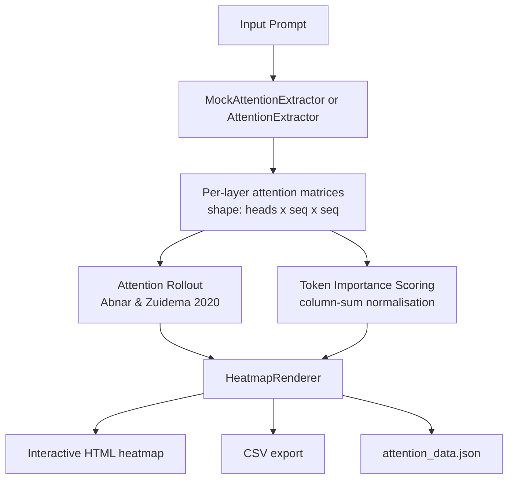

# nemotron-attention-vis – Attention head visualizer for Nemotron-Cascade-2-30B-A3B

> *Made autonomously using [NEO](https://heyneo.so) · [](https://marketplace.visualstudio.com/items?itemName=NeoResearchInc.heyneo)*

[](https://www.python.org/)
[](LICENSE)
[]()

> Inspect exactly which tokens `nvidia/Nemotron-Cascade-2-30B-A3B` attends to — interactive HTML heatmaps, CSV export, and attention rollout, no GPU required.

## The Problem

Existing attention visualization tools (BertViz, TransformerLens) target small encoder models and break or time-out on 30B+ parameter architectures. Debugging why a frontier model fixates on the wrong token — or validating that a fine-tune changed the right attention patterns — has no lightweight tooling. This fills that gap with a mock-first, offline-friendly approach that works without downloading 60GB of weights.

## Who it's for

ML engineers and researchers interpreting or debugging large-scale Nemotron models. For example: you fine-tuned `Nemotron-Cascade-2-30B-A3B` for code generation and want to confirm the model attends to function signatures rather than comments — run this in mock mode on any machine first, swap in the real model on your GPU box when ready.

## Install

```bash
git clone https://github.com/dakshjain-1616/nemotron-attention-vis
cd nemotron-attention-vis
pip install -r requirements.txt
```

## Quickstart

```python
from nemotron_attention_v import visualize

# Mock mode — works offline, no model download needed
html, json_path = visualize(
    prompt="Explain quantum computing",
    mock=True,
    output_dir="outputs",
    export_csv=True,
    rollout_view=True,
)
print(f"Open: {html}")
# -> outputs/attention_map.html
```

Or from the command line:

```bash
python scripts/demo.py --mock --prompt "Explain quantum computing"
# -> opens outputs/attention_map.html in browser
```

## Example output

```json
{
  "model": "nvidia/Nemotron-Cascade-2-30B-A3B",
  "mock_mode": true,
  "num_attention_layers": 8,
  "num_heads": 16,
  "runs": [
    {
      "prompt": "Explain quantum computing",
      "html": "outputs/attention_map.html",
      "elapsed_s": 0.31
    }
  ]
}
```

## Compare two prompts side-by-side

```python
from nemotron_attention_v import compare_prompts

html = compare_prompts(
    prompts=["The capital of France is", "Neural networks learn by"],
    mock=True,
    output_dir="outputs/comparison",
)
```

## Pipeline



## Key features

- **Mock mode** — generates synthetic attention patterns in milliseconds; no model download needed
- **Attention rollout** — computes effective attention path through all layers (Abnar & Zuidema, 2020)
- **Token importance scoring** — ranks tokens by mean received attention across layers and heads
- **Multi-prompt comparison** — side-by-side HTML diff of two attention maps
- **CSV + JSON export** — pipe results into notebooks or downstream analysis
- **Real model support** — set `mock=False` to load the actual HuggingFace model on GPU

## Run tests

```bash
pytest tests/ -q
# 90 passed in ~2s
```

## Project structure

```
nemotron-attention-vis/
├── nemotron_attention_v/
│   ├── __init__.py          # public API: visualize(), compare_prompts()
│   └── visualize_attention.py
├── tests/
│   └── test_attention.py    # 90 tests — mock extractor, renderer, e2e
├── scripts/
│   └── demo.py              # CLI entry point
├── examples/                # step-by-step usage scripts
├── outputs/                 # generated HTML/JSON (git-ignored)
├── requirements.txt
└── .env.example
```
